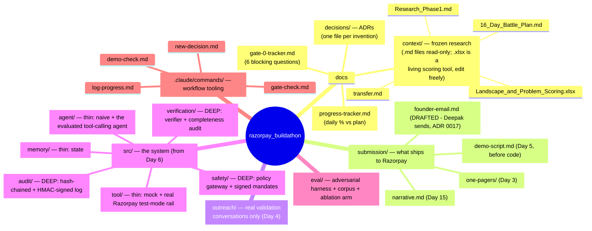

# Repo Map

A navigation aid for future sessions (human or Claude) — where things live, why,
and when each folder gets touched across the 16-day plan. Pair this with
`CLAUDE.md` (the rules) and `docs/progress-tracker.md` (the live status).

## Routing logic — "where does X go?"

- **"I just decided/invented/designed something"** → `docs/decisions/`, via
  `/new-decision`. Never edit the three frozen `.md` files in `docs/context/`
  to reflect a new choice — the scoring `.xlsx` is the one exception, edit it
  directly, and log anything thesis-changing as an ADR too.
- **"I learned a new fact about Razorpay/the market"** → if it changes the
  problem thesis, that's a decision (`docs/decisions/`); if it's a passive
  fact worth keeping, it belongs in a future research-refresh doc under
  `docs/context/`, not bolted onto the original frozen files.
- **"I need to know if we're allowed to pre-build"** → `docs/gate-0-tracker.md`.
- **"Am I on schedule?"** → `docs/progress-tracker.md`.
- **"This needs to reach a Razorpay judge or reviewer"** → `submission/`.
- **"I talked to a real merchant/founder/finance person"** → `outreach/`,
  never `docs/context/` (that folder is frozen).
- **"I'm about to roleplay a synthetic user for validation evidence"** →
  don't. See `CLAUDE.md` rule 5 and `outreach/README.md`.
- **"I'm writing actual system code"** → `src/<layer>/`, matching the
  depth allocation table in `docs/context/Razorpay_16_Day_Battle_Plan.md` §4
  (agent/tool/memory = thin, safety/verification/audit = deep).
- **"I'm writing an adversarial test or scoring a run"** → `eval/`.
- **"I'm about to email the founder"** → stop. Check `CLAUDE.md` rule 8 first.
